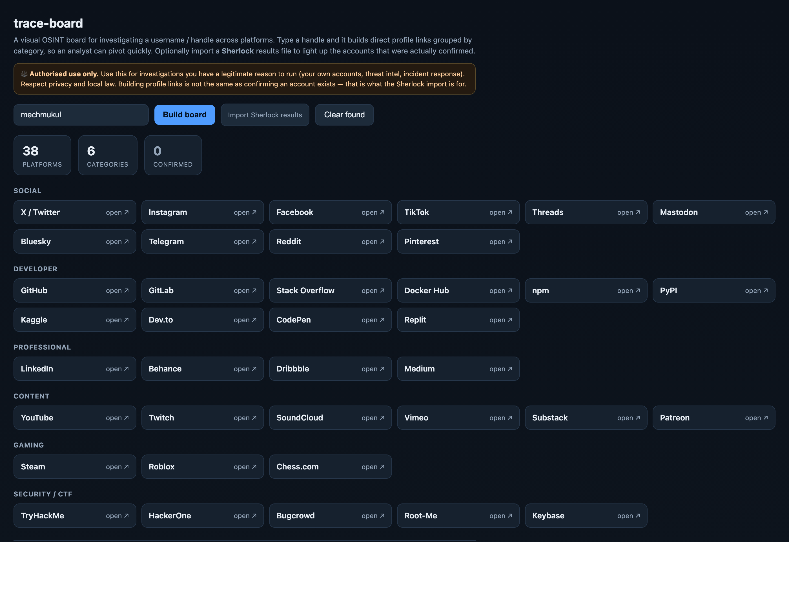

# trace-board

> A visual board for investigating a username across platforms — the OSINT pivot, made fast and clickable.

**▶ Live demo:** https://mechmukul.github.io/trace-board/ · runs in your browser, no install.



## What it is
Type a handle and trace-board builds **direct profile links across ~38 platforms**, grouped by
category (Social, Developer, Professional, Content, Gaming, Security/CTF), so an analyst can pivot
through them quickly. Import a **Sherlock** results file and it lights up the accounts that were
actually confirmed.

## Why it's useful
Pivoting on a username is a core OSINT / threat-intelligence technique — the same handle often
reappears across an actor's accounts. [Sherlock](https://github.com/sherlock-project/sherlock) does
the heavy lifting of *checking* hundreds of sites from the command line; trace-board gives that work a
fast **visual front-end**: one board of clickable, categorised profile links, with confirmed hits
highlighted. It turns a flat list of URLs into an investigation you can actually navigate.

## Who it's for / use cases
- **Threat intel / SOC analysts** pivoting on an actor's handle during an investigation.
- **Incident response** — quickly checking where a compromised or impersonating handle appears.
- **Personal footprint checks** — see where *your own* handle exists and reduce exposure.
- **Anyone who runs Sherlock** and wants a readable, shareable visual of the results.

## Try it live (30 seconds)
1. Open the live demo (it loads a sample handle).
2. Type any username and click **Build board** — profile links appear, grouped by category.
3. Click any card to open that profile in a new tab.
4. **Import Sherlock results** (see below) to mark confirmed accounts green.

## Using real Sherlock results
trace-board builds *candidate* links; it does not itself confirm an account exists (browsers can't
check hundreds of sites due to cross-origin limits). To confirm, run Sherlock and import its output:
```bash
pip install sherlock-project
sherlock <username>          # writes <username>.txt listing the confirmed profile URLs
```
Then click **Import Sherlock results** and choose `<username>.txt` — every matching platform card
turns green with a ✓. (The `.txt`, `.csv`, or `.json` output all work; it matches on the URLs inside.)

## How it works
- A curated platform list maps each site to a profile-URL template (`https://github.com/{u}`), filled with your handle.
- Import parses every URL in the Sherlock output and matches it to a platform by hostname, marking it confirmed.
- Everything runs client-side — no data leaves your browser.

## Responsible use
This is for **authorised** investigations — your own accounts, threat intelligence, or incident
response — with respect for privacy and local law. Building a profile link is not proof an account
exists; treat unconfirmed links as leads, not facts.

## Tech
Vanilla HTML/CSS/JS, zero dependencies, deployable as a static page. Inspired by and interoperable
with [Sherlock](https://github.com/sherlock-project/sherlock) (MIT). Curated platform set — not exhaustive.

---
MIT licensed · Built by **Mukul Mech** · Part of a security tooling portfolio: [set-watchtower](https://github.com/mechmukul/set-watchtower) · [set-triage-atlas](https://github.com/mechmukul/set-triage-atlas) · [gvm-triage](https://github.com/mechmukul/gvm-triage)
